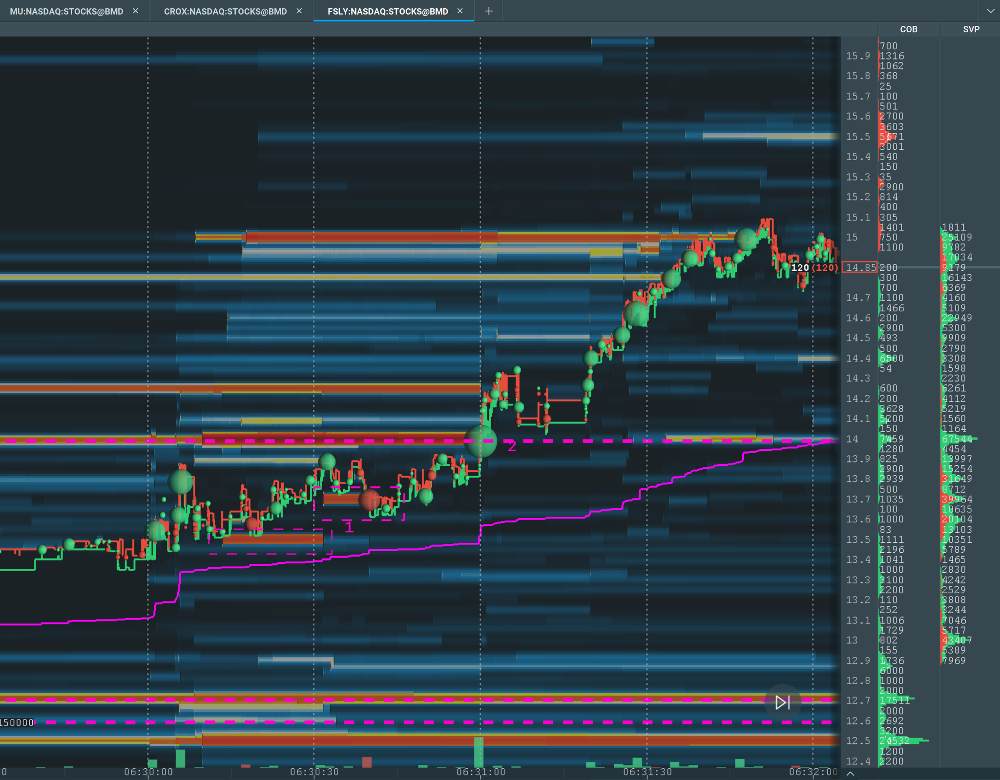

# Big Offer Clear, Bids Hold Above

* Entry
  * Buyers clear a big offer wall
  * Then the  price may or may not make a pullback. And before seeing the pullback, we don't know whether price will pull back or not.
  * Enter the long trade when bids hold above the old offer wall for a few seconds.
* Stop loss
  * The swing low before the push that cleared the offer wall.

