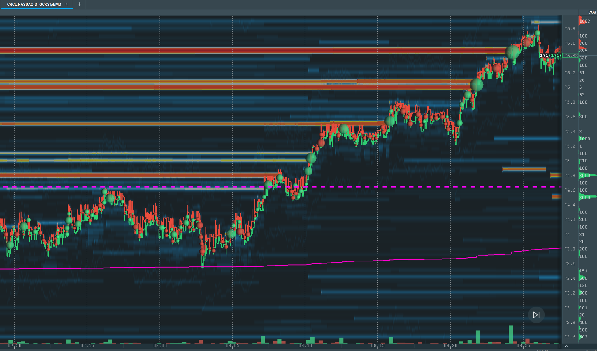

# Big Offer Clear, Pullback, Go

* Entry
  * Buyers clear a big offer wall, then price makes a pullback, enter the long trade when it makes a new high. After seeing the pullback, place a buy stop order right above the highest ask price before the pullback.
* Stop loss
  * Tight stop: the low of the pullback before making the new high.
  * Wide stop: the low before the push that cleared the offer wall.

