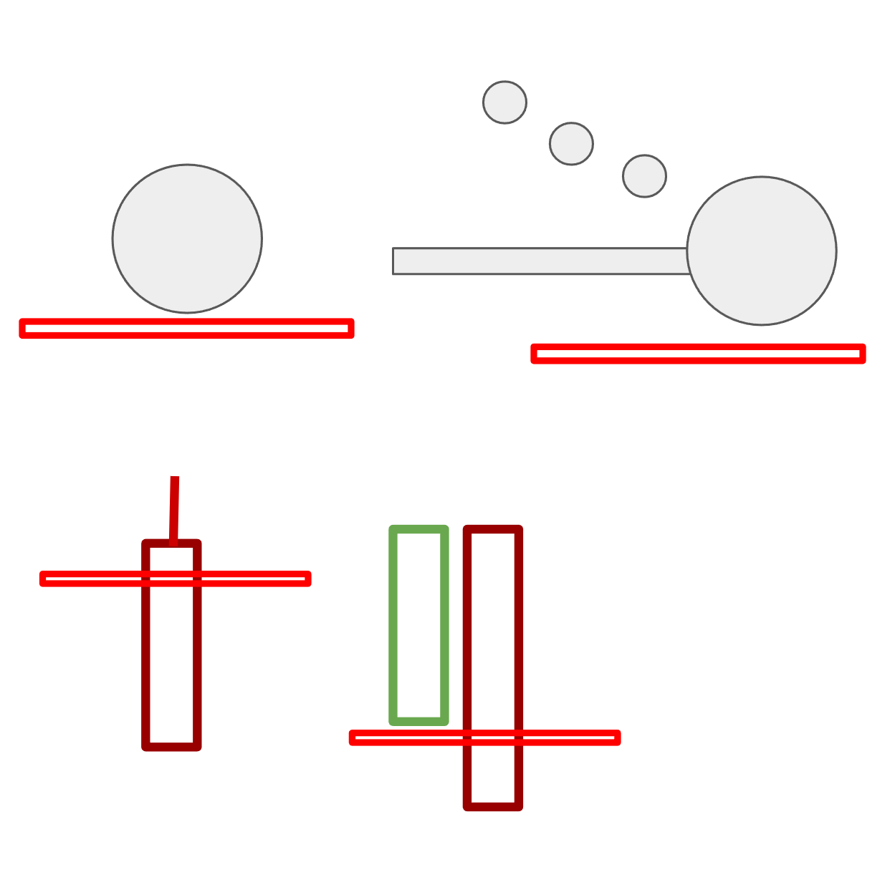
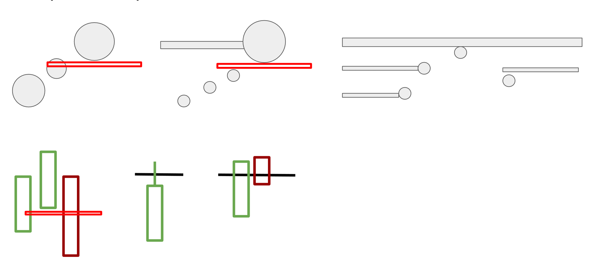

# Gap and Crap

## Key Characteristics

- Stock gaps up on news.
- Higher timeframe context suggests **profit taking** or **strong overhead supply**.
- Selling pressure is expected to appear **immediately or very early** in the session (first 30 minutes after the open).

## Stock Selection

Use the shared stock selection rules in [`tradebooks/shared/stock-selection.md`](shared/stock-selection.md).
For the daily tradebook decision process, use [`tradebooks/shared/tradebook-decision.md`](shared/tradebook-decision.md).

## Higher Timeframe Conditions (A+ Context)

At least one of the following should be true. More boxes checked = higher quality **Gap and Crap**.

### 1. Accumulated Too Much Profit

There is a lot of unrealized profit for buyers that is suddenly created by this gap. This makes it rational for those winning traders to sell right at the open.

- Prior day: **big trend day up** with no real reason to sell. Traders hold overnight and wake up with even more PnL.
- Prior weeks/months: **steady uptrend** with shallow or no pullbacks. ([example](https://www.notion.so/241d17cd21b380a78216ff7a759df4a5))
- **Earnings gap**: buyers positioned ahead of earnings are heavily rewarded on the open.
- Big gap:
  - Mag7: more than **1 ATR**
  - Others: more than **2 ATR**
  - These are just guidance. 1.9 ATR is not too different from 2 ATR. And if a stock opened with 1.5 ATR gap, and it went up for another 0.5 ATR after market open, that makes it 2 ATR above previous day close price and now it qualifies for 2 ATR gap up short.

### 2. Gap Near Range Top

- The gap **does not cleanly break out** of the main daily range.
- Instead, price opens **very close to the top edge** of the existing range. ([example](https://www.notion.so/2bfd17cd21b380df8cdfc95b4cf3f0bc))

### 3. Gap Into Heavy Supply Zone

- Stock gaps into a **heavy zone / supply area** created by:
  - **10+ days** of prior trading
  - A few days with elevated volume
- Open can be:
  - Inside the zone
  - Or just **below the bottom edge** of the zone
- ([example](https://www.notion.so/2dfd17cd21b3803bb8b2d212e8547932))

## Key Level Selection Priority
After the stock is considered for gap and crap with a given reason, we pick a level as key level. We can only short the stock when the price is below this key leve. It's ok to short it above vwap, it just being a different sub pattern for this tradebook. The premarket high is also considered a special threadshold. No matter which reason is used for gap and crap, we can not short the stock if it gets above premarket high. 
### Level from Higher Timeframe Condition
For each category of the daily chart context, we have ways of choosing the key level.

- Accumulated Too Much Profit
  - This is not at any resistance on the daily chart, we use the news high as key level
  - for after hour news, use after hours high
  - for morning news, use premarket high
- Gap Near Range Top
  - Use the top edge of the range as key level
  - once price breakout of the range, we cannot short it any more
- Gap Into Heavy Supply Zone
  - we can either use the top edge of the zone, or use the news high level.

### Previous News Level
There have been a previous news and that previous news created an extreme high/low price. That price hasn't been broken out yet. 

### Intraday Level
- Default is the news levels. For after hour news, it's after hours high/low. For morning news, it's premarket high/low.
- R6 cam pivots. That's because it's the last cam pivot, beyond that, it opens for more room.

After consider all those above, we pick a final level as our key level. It's a bit discretionary of which one to use. We prefer to align more with the higher timeframe.

## Premarket Conditions (Bonus)

Look for these early signs of selling during premarket.

- **Premarket downtrend**, trading **below VWAP/level** into the open
- **Lost VWAP/level** right before the bell
- Premarket attempts to **reclaim VWAP but fail**, then rolls back under VWAP into the open

## Entry Models
For gap and crap, we have many entry models. Unlike gap and go, we just have one. The reason is that stock already gaps up, sellers can come in early for mean reversion. But a good higher timeframe short thesis is still not permission to short blindly at the open. The first 1-2 minutes should prove that sellers are actually showing up. Bookmap confirmation is preferred because it aligns better with the idea of following large players.

### Entry Model: Short Open Flush
Short open flush is no longer a standalone entry just because the stock opens weak. It is an early weakness alert that can become actionable only when a second trigger appears within the first 1-2 minutes after market open.

The best version is when the open flush also shows a Bookmap pattern inside the first 1-minute candle or immediately after. Preferred confirmations are:

- big ask wall rejection near the key level
- big ask wall breakout fail near the key level
- big bid wall breakdown
- anchor volume dot breakdown

If Bookmap is not clear, a candle trigger can still be used only when it is immediate and obvious. Examples:

- premarket high rejection
- red to red / green to red in the first minute
- first new low after a failed pop

Rules for this pattern:

- no naked short just because price ticks below the open
- the second trigger should happen before the close of the 2nd 1-minute candle
- if the stock opens with no real volume, start counting when real volume comes in
- default stop loss is still high of day
- if the confirmation gives a tighter and cleaner micro-structure stop, that can be used instead
- if the second trigger never appears, no trade

The benefit of this pattern is still low risk from entering early near high of day. But without a second trigger, the pattern is too noisy.

### Entry Model: Vwap Continuation
If open price is below vwap, we can short any breakdown. It preferable to also have a bookmap wall breakdown pattern, but it's not required since stock already gapped up.

This setup is cleanest when:

- open is below or near VWAP
- price pushes into VWAP
- VWAP rejects
- entry triggers on low-of-day breakdown or equivalent confirmation below VWAP

### Entry Model: Bookmap Entries Big Wall Breakdown

- Identify a significant bid wall on Bookmap showing concentrated liquidity.
- When price moves down to approach a large resting order wall, wait for it to form a large volume dot near the wall.
- The large volume dot takes out the wall.
- Short when price is below the wall and dot.

### Entry Model: Bookmap Entries Big Wall Breakout Failed

- Identify a significant ask wall on Bookmap showing concentrated liquidity.
- When price moves up to approach a large resting order wall, wait for it to form a large volume dot near the wall.
  - If the volume dot takes out the wall, short when the current price is below the dot or ask price is below the previous all price.
  - If the volume dot does not take out the wall, wait for price to get below the dot with more confirmation before shorting.
- This works best when the wall represents a key level (VWAP, premarket high, or range resistance). It is often the premarket high rejection short.
- If the failed wall breakout also happens at VWAP, then both the failed-wall and VWAP-continuation management rules apply. Use the stricter rule for the runner.

### Entry Model: Bookmap Entries: Anchor Volume Dot Breakdown

After open, wait for volume to come in and form a large volume dot. Short when price is below a chosen volume dot; that volume dot is the anchor volume dot.

This entry is essentially shorting the low-of-day breakdown. Place a sell stop order at the low of the day.

If price continues to move up, the sell stop order will not trigger. If it forms a larger volume dot at a higher price level, raise the anchor to that larger volume dot and move the sell stop just below that dot.

### Low of Day Breakdown

### Above Low of Day

### 4. Candlestick Entries: First New Low / Current Candle Red to Green

Opening-momentum candlestick entries should trigger early after the open. For Bookmap entries, there is no fixed 5-minute cutoff. Big sellers can appear in the first 5 minutes or later in the day; use Bookmap to judge whether sellers are actually increasing.

### Shorting Above VWAP

When price is above VWAP, be much more selective with short entries. A breakdown above VWAP can simply be a normal pullback inside an uptrend.

Do **not** short above VWAP using generic breakdown patterns such as:

- big offer wall clear, fail back below, breakdown swing low
- bid breakdown
- low-of-day / swing-low breakdown while price is still above VWAP

These can look like short triggers, but when price is above VWAP they may only be pullbacks before trend continuation.

Only two Bookmap short patterns are allowed above VWAP:

1. **Big offer wall reappear**
   - price pushes into / through a major offer wall
   - price fails to stay above it
   - the offer wall reappears at the same price or lower
   - this shows sellers are still present and defending the level

2. **Big offer wall steps down**
   - a major offer wall appears above price
   - then similar heavy offer liquidity appears lower
   - sellers are moving down toward price instead of letting price continue higher
   - this is evidence that sellers are coming in more aggressively

Reason:

Above VWAP, breakdown patterns are often just pullbacks in an uptrend. Offer-wall reappear and offer-wall steps-down are different because they show new or increasing seller pressure from above while price is consolidating or failing to continue higher.

Below VWAP, breakdown patterns can be used more freely because price is already on the weaker side of VWAP.

## Trade Management

### Stops

- Default is high of day
- Tight stop is the high of the anchor volume dot

### Risk Level

- Default is the stop loss level
- Can use a different level if you want to reduce risk

#### Targets

1. 10-30% at VWAP
2. 30-50% at premarket low / yesterday high
   - Past 4 months shows 80% win rate: if the stock rejects at premarket high, once it gets back below premarket high and stays below it for the next 5 minutes, there is an 80% probability it needs to go down to touch premarket low (or gap fill to yesterday high) before making a bounce.
3. For **Power Gap and Crap**, treat premarket low as a checkpoint, not the automatic final target
   - if price gets through premarket low and still stays accepted below VWAP, keep a small runner for bigger extension / gap fill targets

#### Signals to Add

1. VWAP bounce fail
2. VWAP rejection
   - After the stock stayed below VWAP for more than 5 minutes, the first pop back to VWAP usually gets rejected.
3. Premarket low breakdown
   - If there is a big space below premarket low to gap fill levels
   - Wait for a weak bounce near premarket low and short when that bounce fails

### Case 2: VWAP Continuation Entry Management

The downtrend already started. Stay in the trend unless the trend is over.

#### After First Profit Target

Once first target is hit, the remaining shares become a runner. The job is no longer to protect the fact that the trade was green. The job is to decide whether price is still accepting below VWAP.

- first target is a partial, not an automatic full exit
- the runner can have more room than the initial scalp because the first target already paid for the trade
- do not add back just because you covered too much; a new short needs a fresh trigger

#### Continuation State

- price stays below VWAP
- bounces into VWAP stay weak or reject
- price does not show strong acceptance back above VWAP
- keep the runner and allow normal intraday noise below VWAP

#### VWAP Continuation Short Warning State

This section is specifically for the **VWAP continuation** variation of Gap and Crap:

- Open is near or slightly below VWAP
- Price pushes into VWAP
- VWAP rejects
- Entry triggers on the low-of-day breakdown or equivalent confirmation below VWAP

For this variation, a **new candle close above VWAP is a warning state**, not an automatic failure.

What that means in real time:

- The setup win rate is now worse
- No new short entries
- No adds back to the short
- Tighten stops and protect the runner more actively
- Manage the existing runner only

The warning state stays active until a **new candle closes back below VWAP**.

Important nuance:

- One candle reclaiming VWAP does **not** automatically mean the trade has fully failed
- But it does mean the trade is no longer behaving like a clean VWAP continuation short
- Do not treat the next push down as permission to re-enter full size unless price proves acceptance back below VWAP again

#### Failure State

One candle close above VWAP is warning, not full failure.

Failure is when:

- price cannot get accepted back below VWAP after warning
- price reclaims above the bounce high / lower high that defined the short

When failure happens:

- exit the remaining runner
- the next short must be treated as a new setup, not as automatic continuation of the previous one

#### Re-entry After Warning or Failure

- allowed only after a new candle closes back below VWAP and the next bounce fails
- allowed on a fresh low-of-day breakdown after only a weak bounce below VWAP
- not allowed in the middle of the range just because the original thesis was good

### Case 3: Failed Bookmap Wall Breakout Entry Management

This section is for the entry where price pushes into a major ask wall, breaks or tags it, and then quickly falls back below it. The wall is the main decision level.

#### After First Profit Target

After first target is hit, the remaining shares are a runner tied to the wall.

- do not exit the whole position just because you are afraid of giving back open profit
- keep the runner while price remains accepted below the wall
- if VWAP is part of the same rejection, price should also stay below VWAP for the cleanest continuation
- the runner gets more room, but the wall and false-break high remain the invalidation anchors

#### Continuation State

- price stays below the wall
- the false-break high remains intact
- pullbacks fail below the wall
- if VWAP is nearby, pullbacks into VWAP also fail

#### Warning State

- price closes above VWAP while still below the wall
- no new short entries
- no adds back to the short
- tighten stops and manage only the runner
- do not short midrange just because the original wall still exists overhead

#### Failure State

- price accepts back above the wall
- or price reclaims above the false-break high

When failure happens:

- exit the remaining runner
- the failed-breakout thesis is over

#### Re-entry Rules

- allowed on a fresh retest and rejection of the wall
- allowed when price gets back below VWAP, stays accepted there, and then breaks low of day after only a weak bounce
- not allowed from random prices between the wall and the first target

## Exit Models / Trade Management
### Profit Targets
Common profit targets are in the order of
1. other levels from higher timeframe (daily chart)
2. levels from intraday charts: cam pivots, premarket high/low, previous day high/low, after hour high/low.
3. other big walls from bookmap

Because we don't know which levels will be the last target that the stock can reach to, we use partial exits to lock in incremental progress. How much at each level and what levels to use, it depends on each trade and it's a bit more discretionary. This partial strategy also applies to the next 2 sections of adjust stop and eearly exits.

### Adjust Stop
We try to stay with our stop for as long as possible. And the purpose of taking partials at each profit target is to allow us more draw downs from the remaining position. The move will be more noisy later after open, so we do need to have more buffer for the trade to work.

There are a few conditions that we can adjust our stop loss
- higher time frame trailing stop
  - after 10 minutes, we can raise the stop loss to the high of the 2nd 5-minute candle, and keep doing that
  - after 30 minutes, we can raise the stop loss to the high of the 2nd 15-minute candle, and keep doing that

There are a few conditions that we should try to never adjust stop loss
- entry was after the retest of the key level
- entry was after the retest of vwap
  - for this one, the stop loss can be the reclaim of vwap

### Early Exits
When seeing the following signals, we can partial or fully exit early before hitting our stop loss and profit targets:
- there are bookmap walls stepping up
- large volume dots printed and price moved up after that.

## Add
This section is not fully done. To keep things simple, only allow add for the following conditions
1. vwap bounce fail
  - Entry or open price is above, add when price gets below vwap

### Signals to Add (needs review)

1. Premarket low breakdown
   - If there is a big space below premarket low to gap fill levels
   - Wait for a weak bounce near premarket low and short when that bounce fails
2. VWAP rejection
   - Wait for pullback to VWAP and see whether seller steps in again. Use Bookmap to find signals when price is near VWAP.

## Power Gap and Crap

This is not a new setup. It is the exceptional-quality version of Gap and Crap.

Use this version when both are true:

- gap up is **4 ATR or more**
- premarket volume is **4 million shares or more**

When a stock qualifies as **Power Gap and Crap**, the expectation should be bigger than the normal Gap and Crap target map. The setup is more active than average and can keep moving well past the first obvious downside target.

Important:

- this changes the **target framework**, not the entry rules
- this does **not** give permission for looser entries

Target framework for **Power Gap and Crap**:

1. Take normal early partials into the first obvious intraday levels / Bookmap bids
2. The final target can be a full gap fill back to previous day's close or previous's high.
3. To lock in profit, we can pick a checkpoint in the middle like premarket low or some other levels, cover the core position there and look for reentry or move stop to near above those middle checkpoints without covering.