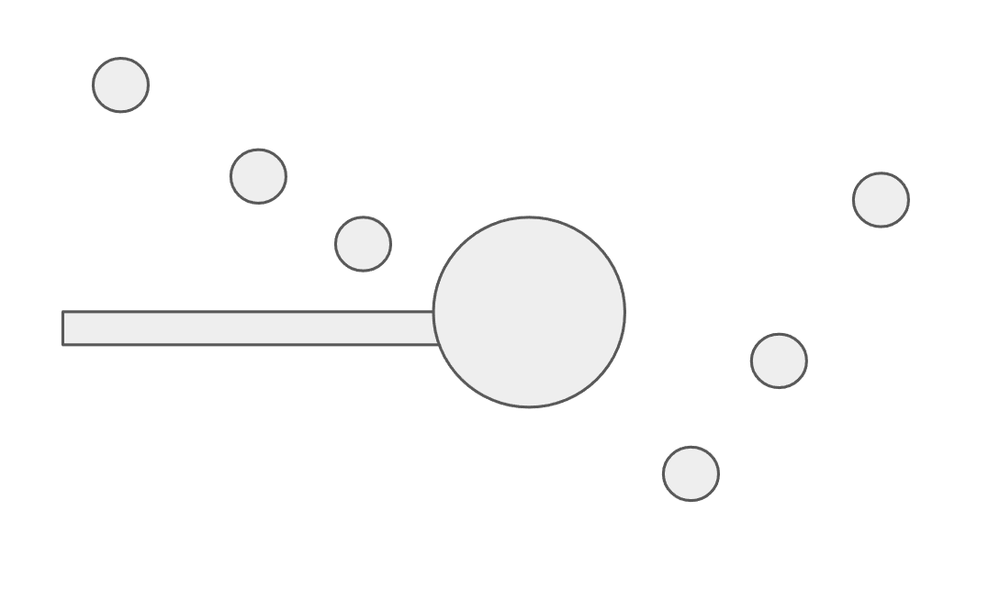
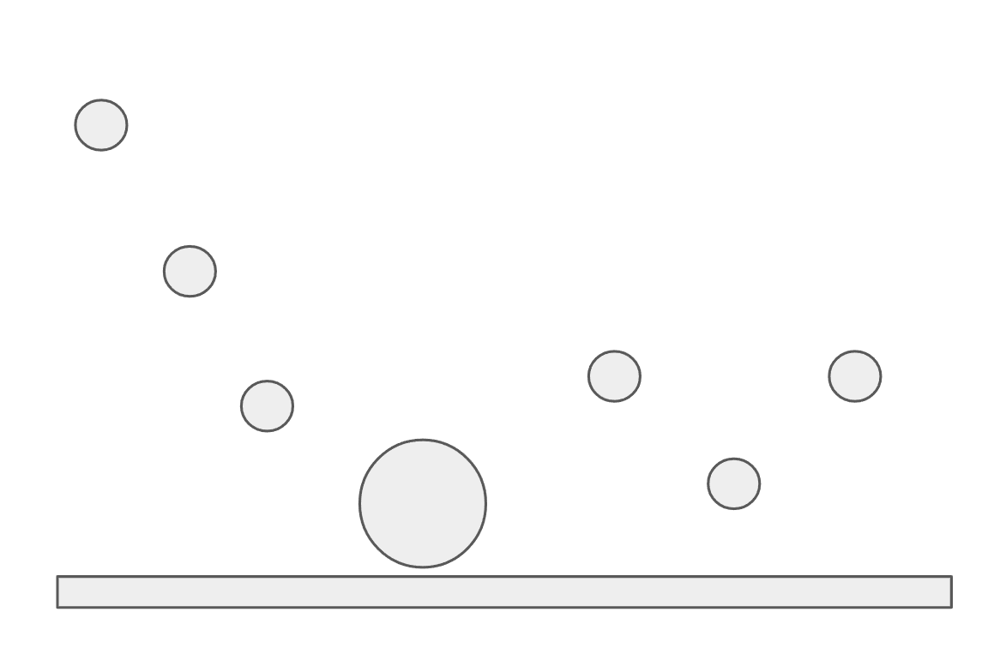
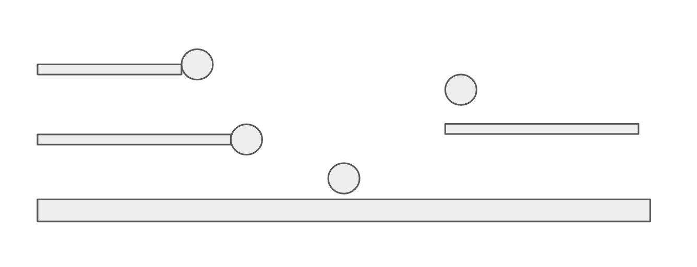
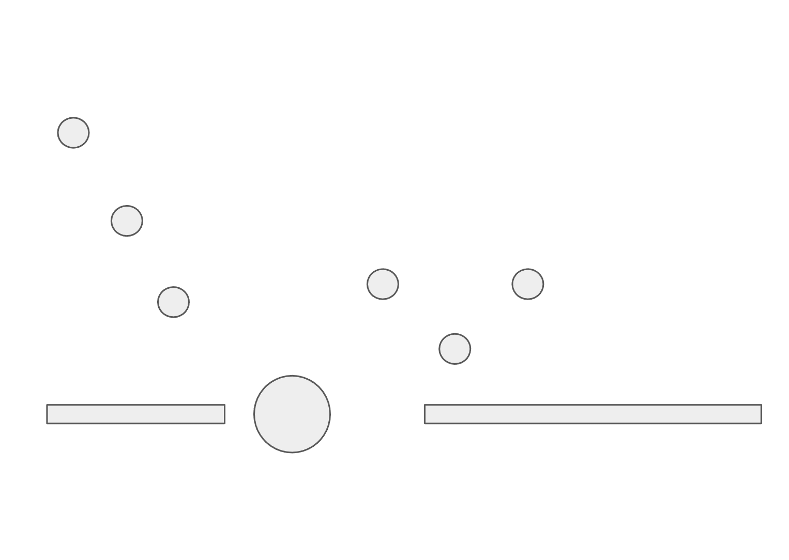
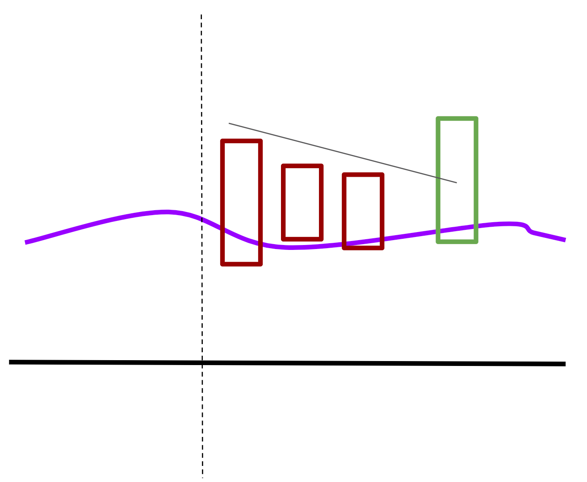
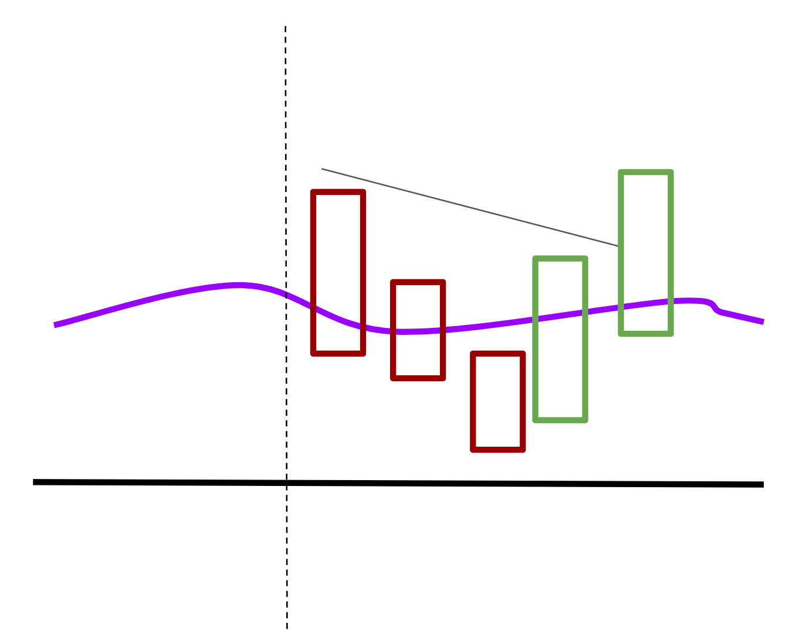

## Setup Variations

Think about Gap and Go in 3 layers:

1. **Main participation level** = the main level that decides whether the stock has truly upgraded into Gap and Go
2. **Setup variation** = where the stock opens relative to the main participation level and VWAP
3. **Entry model** = how the actual trigger happens once the setup variation is valid

The main participation level and setup variation decide whether this is still **Gap and Go** or whether it is still **Gap Give and Go**. The entry model is then how you actually get in, such as Bookmap wall breakout or candlestick new-high breakout.

### Main Participation Level vs Support / Invalidation Level

Before the open, define these separately:

- **Main participation level**
  - decides setup classification
  - decides when a trade upgrades from `gap_give_and_go` into `gap_and_go`
- **Support / invalidation level**
  - decides whether the opening pullback is still constructive
  - helps define where the stop belongs

This helps keep the tradebook organized:

- do **not** create a new tradebook just because the trigger looks different
- do create a separate tradebook when the pullback depth, support logic, or invalidation logic becomes meaningfully different
- for review and journaling, keep the parent setup as `gap_and_go` and add a variation tag underneath it

### Open Price Below Main Participation Level

- Long when the stock breaks out above the main participation level
- If the long entry is taken **before** the main participation level breaks, that is **Gap Give and Go**, not Gap and Go
  - That still needs to be above a key daily level, like the consolidation high
  - The breakout of the main participation level becomes the main level to add or to upgrade the trade into Gap and Go management

### Open Price Above Main Participation Level

This broad variation can be split into 2 sub-variants.

#### 1. Shallow Hold Above VWAP

- Use this when the stock opens above the main participation level and VWAP is still close enough that the opening pullback is clearly holding in a constructive area
- Long the next HOD breakout or local new-high breakout after a small dip due to profit taking
- The dip needs to hold above VWAP and above the main participation level
- An exact touch of VWAP is **not** required for this sub-variant
- But price still needs to pull back **toward** VWAP and show that bids are absorbing profit taking rather than just floating far above support

#### 2. All-Time-High / Price-Discovery Gap Far Above VWAP

- Use this when the stock opens above all-time high or another major breakout level and is already stretched far above VWAP
- In this case, do **not** call the first pullback a VWAP continuation long unless price actually tests VWAP
- For this tradebook, an actual VWAP test means price needs to touch VWAP or trade through it briefly. Simply pulling back in the direction of VWAP while still clearly extended above it is not enough
- After that VWAP test, long only if VWAP holds and price reclaims local structure or breaks back to new highs
- If there is no actual VWAP test, then the valid long is only the **shallow hold new-high breakout** version above. If that clean shallow-hold structure never forms, there is no trade

#### When Open-Above-Main-Participation-Level Is No Longer Gap and Go

- If the pullback is too deep and goes below the main participation level or VWAP, it transitions into the Gap Give and Go tradebook
- If price is so extended above VWAP that there is no real nearby support and the stop would be based on hope instead of structure, do not force a VWAP continuation long
- An all-time-high gap up is still not permission to buy random extension. It still needs either a shallow hold above VWAP or an actual VWAP test and reclaim
- If price loses both the support / invalidation level and clean VWAP behavior, the opening Gap and Go idea is dead. Any later long must be treated as a full reset entry, not continuation of the same opening trade

#### Suggested Variation Tags

Use tags like these in reviews or journals so the parent setup stays clean:

- `gap_and_go / below-main-level breakout`
- `gap_and_go / above-main-level shallow hold`
- `gap_and_go / above-main-level vwap-test`

## Bookmap Big Wall Breakout

### Additional Bookmap Patterns

#### 2. Big Wall Taken Out Hold

If open price is already above a key level, it can open with a small dip, then hit a big wall with a large volume dot. Price should hold above this level. It can go below it briefly, but it should mostly hold above it.

#### 3. Consolidation Above Big Wall

Price gets to a big wall and does not take it out. Price then moves up and down above the level and starts consolidating above the wall. Once the top of the consolidation becomes obvious, buy the breakout of that consolidation high.

#### 4. Big Wall Steps Up

Price may or may not take out the last wall. Then price moves up and a higher wall appears.

#### 5. Big Wall Reappear

After a big wall is taken out, price still holds above it, and then another wall near the same price shows up again.

## Candlestick New High Breakout

### Entry

Long the first breakout. If the first candle is a pullback, long the 1-minute ORB. If the second candle is also a pullback with a lower high, long above the high of the second candle. Keep doing that until the high of any candle is below VWAP.

If there are 2 consecutive candle closes below VWAP, wait for a new candle close back above VWAP before longing the next breakout.

### Stop Loss

Default stop loss is the low of day. It can be tightened to VWAP bounce fail.

## Profit Taking

Use the following levels to set partials, ordered by importance. When there are no levels for one type, move on to the next type.

1. Key levels from the daily chart
2. Premarket levels (premarket high, after-hours high)
3. CAM pivots
4. Bookmap larger order levels

## After Stop Loss

- Cool down
- Ask whether only the breakout pullback low failed, or whether the support / invalidation level and clean VWAP behavior also failed
- If price loses both support / invalidation and clean VWAP behavior, the original morning Gap and Go thesis is dead
- A later long is allowed only as one full reset entry after reclaim and new base formation
- No repeated buybacks on the first bounce after thesis failure

## Add to Winners

Breakout of another level can be added, but only when there is a shallow pullback near the add level. The new stop for adds will be the low of that pullback. If the pullback is too deep, the stop becomes too wide and the add is not good. Ideally, add only about 10% of current open profit, measured by how much the trade is in the money at the add level.

## Notes

- Gap Give and Go is a separate tradebook when the stock is too extended or the pullback is too deep.
- For standard morning-news names, premarket high is the default main participation level:
  - long below premarket high = Gap Give and Go
  - long after premarket high breakout and acceptance = Gap and Go
- Allowed alternative main participation levels, decided before the open:
  - all-time-high / price-discovery breakout level
  - previous major news level that institutions are still defending
  - very clean daily breakout level
- If price is above support / invalidation but still below the main participation level, that is still Gap Give and Go, not Gap and Go
- If the structural stop fails, any later long must be treated as a reset entry, not continuation of the original opening trade
- For all-time-high or price-discovery gap-ups:
  - shallow pullback above VWAP = Gap and Go shallow-hold variation
  - far above VWAP and no actual VWAP test = do not call it VWAP continuation long
  - actual VWAP test and hold = acceptable Gap and Go VWAP-continuation variation
- The source Notion page also ended with an unfinished note, `what invalidates the`, without an actual rule attached. No extra invalidation rule beyond the participation conditions, stop-loss logic, and transition rules above was specified in the source.